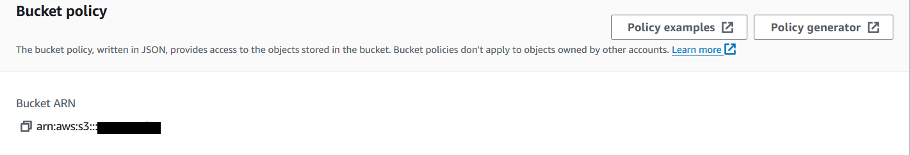

# DEPLOYMENT

## Clone repository
* To make a local copy of this project, you can clone the repository by typing the following command into your IDE terminal:

    `git clone https://github.com/nhamidi90/unnie_style.git`

* Alternatively, to open the workspace in Gitpod, you can [click here](https://gitpod.io/#https://github.com/nhamidi90/unnie_style)

## Create database and Heroku app
* Create a database
* Go to the Heroku dashboard an select 'Create new app'
* Enter a unique name and select your region. Click 'Create App'.

## Connect to database and load fixtures
* Inside your project, go to the settings tab and select the 'Reveal config vars' button and add the DATABASE_URL config var and paste in your database url 
* In your workspace install dj_database_url and psycopg2: 

    `pip3 install dj_database_url==0.5.0 psycopg2`

* Freeze requirements:

    `pip freeze > requirements.txt`

* In settings.py, add this line under import os:

    `import dj_database_url`
* Scroll to databases and update the code:

```
# DATABASES = {
#     'default': {
#         'ENGINE': 'django.db.backends.sqlite3',
#         'NAME': os.path.join(BASE_DIR, 'db.sqlite3'),
#     }
# }

DATABASES = {
    'default': dj_database_url.parse('your-database-url-here')
}
```

* To check you are connected you can run:

    `python3 manage.py showmigrations`
* Migrate your database to the new database:

    `python3 manage.py migrate`
* Load the fixtures by running these 2 commands in the terminal. Categories must be loaded first. 
    `python3 manage.py loaddata categories`

    `python3 manage.py loaddata products`

* You will have to add the extra images manually through the admin but first you will need to ensure they are downloaded from GitHub:
https://github.com/nhamidi90/unnie_style/tree/main/media:
* Create a superuser. The email can be left blank:

    `python3 manage.py createsuperuser`

* Go to `{{your web addess}}/admin` and sign in using the details you just created

* Under the 'products' category, select 'Other Images'. Select 'Add Other Images' and proceed to add your images

* You need to delete your database again to prevent it from being exposed to GitHub and uncomment out the original database code. You will also need to add an if statement for when the app is running on Heroku. The code should look like this:
```
if 'DATABASE_URL' in os.environ:
    DATABASES = {
        'default': dj_database_url.parse(os.environ.get('DATABASE_URL'))
    }
else:
    DATABASES = {
        'default': {
            'ENGINE': 'django.db.backends.sqlite3',
            'NAME': os.path.join(BASE_DIR, 'db.sqlite3'),
        }
    }
```

## Connect to Heroku

* **Important!** Please make sure DEBUG is set to FALSE when in production. It should already be set to false with this line in settings.py:

    `DEBUG = 'DEVELOPMENT' in os.environ`
* Install gunicorn:

    `pip3 install gunicorn`
* Create a Procfile with the following line. There should be no space after the line:

    `web: gunicorn unnie_style.wsgi:application`
* Freeze requirements again

    `pip freeze > requirements.txt`
*   Log in to your Heroku account in the browser and go to Account Settings in the menu under your avatar.
    Scroll down to the API Key and click Reveal
    Copy the key
    In the Gitpod terminal, run 
    
    `heroku login -i`

    Paste in your API key when asked
* Temporarily disable collect static by typing into the terminal:

    `heroku config:set DISABLE_COLLECTSTATIC=1 --app unnie-style`
* Add the url of your Heroku app to ALLOWED_HOSTS in settings.py
* Commit and push to GitHub
* Go back to you app on Heroku and from the deploy tab, select connect to GitHub. Select your repository
* In the settings tab, add a new config var: SECRET_KEY. Generate a secret key by searching for a django secret key generator website and paste the code in
* In your project setting.py, replace the secret key variable to:

    `SECRET_KEY = os.environ.get('SECRET_KEY', '')`

## Connect to AWS

### Create S3 bucket
* Create an AWS account and search for S3
* Create a new bucket. Make sure under Object Ownership that 'ACLS enabled' is selected. Uncheck 'block all public access'. Create bucket
* Once that is created, click on your bucket. On the Properties tab, scroll down to 'static web hosting'. Set the home/default page to 'index.html' and error link as 'error.html', then save.
* On the Permissions tab, paste the following into the Cross-origin resource sharing (CORS) section
```
[
    {
        "AllowedHeaders": [
        "Authorization"
        ],
        "AllowedMethods": [
        "GET"
        ],
        "AllowedOrigins": [
        "*"
        ],
        "ExposeHeaders": []
    }
]
```
* On the Bucket Policy section, copy the ARN 

and select 'policy generator'. Add these settings:

Select type of policy: 'S3 bucket policy'

principal: *

Actions: GetObject


Paste in the ARN into the ARN Field

* Click add statement then generate policy, and copy this policy into the Bucket policy editor.
* Before you save, in Resource, add /* to the end to allow access to all resources in this bucket. It shoulf look like a bit like this:

    `"Resource": "arn:aws:s3:::{{bucket name}}/*"`
Click save
* Go to the Access control list (ACL) section, click edit and check 'List' for 'Everyone (public access)' .

### Create IAM
* Open up IAM on your AWS account, click 'User Groups' on the left hand side and 'create group'
* Enter a user group name and click create user group 
* Go to 'Policies' on the menu to the left of the screen then 'Create Policy'. Open the JSON tab and on the actions dropdown, select 'Import policy'
* Search S3 then import S3 full access policy
* Get the ARN from your S3 bucket policy page and paste it under 'Resource' so it looks similar to this:
```
"RESOURCE": [
   "arn:aws:S3....",
   "arn:aws:S3..../*",
]
```
* Click review policy. Give it a name and description. Create policy
* To attach the policy to the group:
* Click 'User Groups' and open up your group. Go to the permissions tab. Open 'Attach permissions' dropdown, search for your policy name and click 'Attach policies'
* On the users page click 'Create user'. Enter a name and give them progrmamatic access. Select Next.
* Add the user to the group by clicking through to the end.
* Now you need to create a CSV file. Select the user for whom you wish to create a CSV file.
* Select the 'Security Credentials' tab and scroll to 'Access Keys' and click 'Create access key'
* Select 'Application running outside AWS', and click next
* On the next screen, you can leave the 'Description tag value' blank. Click 'Create Access Key' then click the 'Download .csv file' button. **This is important as you will need it later and you will not be able to download it again**

## Connect Django to S3

* In your workspace, install boto3 and django-storages:

    `pip3 install boto3`

    `pip3 install django-storages`
* Freeze requirements.txt:

    `pip freeze > requirements.txt`
* In settings.py under INSTALLED_APPS, add 'storages',
* scroll down to #bucket config and update AWS_STORAGE_BUCKET_NAME and AWS_S3_REGION_NAME to match your own
* Open the CSV file you downloaded from when you created an IAM and use those variables for the next step.
* Go to heroku config vars and add variables for 
```
AWS_ACCESS_KEY_ID
AWS_SECRET_ACCESS_KEY
USE_AWS and set it to True
```

* Also **remove the DISABLE_COLLECTSTATIC variable** in Heroku config vars
* Commit and push to GitHub. You should see a static folder in your S3 bucket, and your static files being rendered on the live site.

## Add media files, and connect to Stripe

* Go to S3 on Amazon Web Service, enter your bucket and create a new folder called 'media'. Add your media files
* Click next then under 'manage public permissions', grant public read access to these objects. Upload.
* In Heroku config vars add the variables for:
```
STRIPE_PUBLIC_KEY
STRIPE_SECRET_KEY
```
* Open your Stripe account go to 'Developers' and find the 'API Keys' tab. You want to copy the publishable key token and secret key token.
* paste the publishable key into the value for STRIPE_PUBLIC_KEY and secret key into the value for STRIPE_SECERT_KEY

* In Stripe, create a new webhook endpoint by going to the webhooks tab, 'Add endpoint'
* Add your Heroku URL followed by /checkout/wh/

    It should look similar to this:

    {{Your heroku url}}/checkout/wh/
* Select receive all events, add endpoint
* You will see the Signing secret. Copy this and add to a new Heroku variable, STRIPE_WH_SECRET

## Sending emails using gmail

* Create a gmail account and turn on 2 step verification
* Scroll down and you will see the App passwords section.
* Type a name for your app and copy the password
* In Heroku add the variables for EMAIL_HOST_PASS, pasting in the password and EMAIL_HOST_USER, adding in your email address 