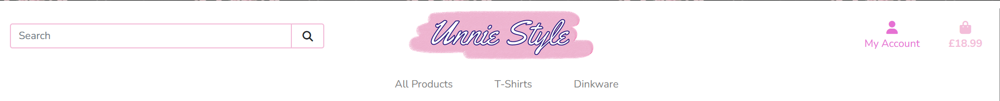
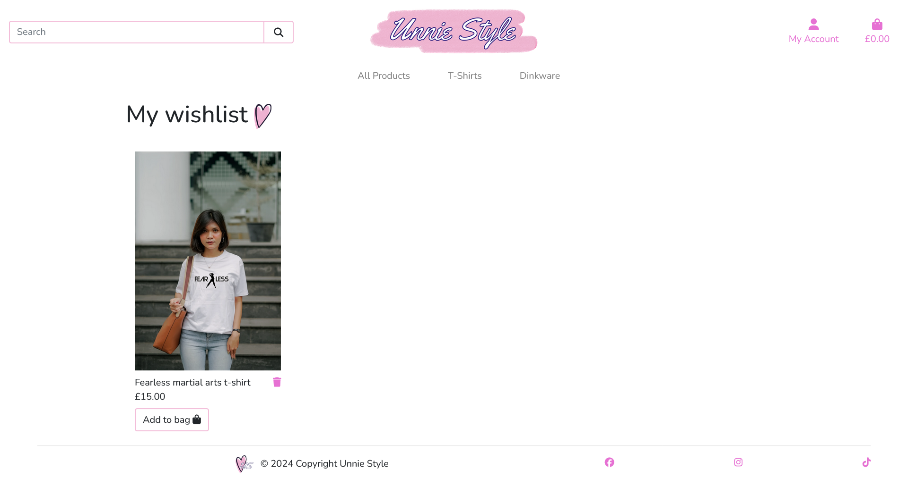

# Unnie Style

Unnie Style is an e-commerce website which allows visitors to browse and purchase a range of products. It is
targeted towards those who are interested in the Eastern Asian culture.

The live link can be found [here](https://unnie-style-5cfa8a993e90.herokuapp.com/)

## User Stories

### As a shopper:
* I want to be able to see the products the company has to offer so that I can see if there is anything I like
* I want to be able to add products to my wishlist from the products page so that I can think about buying it later
* I want to see details of each product including different pictures so that I can make an informed decision on whether I like the product
* I want to be able to search and filter products using a range of filters so that I can find them easily
* I want to be able to add items to the bag from the product detail page to start the checkout process
* I want the checkout process to be quick and easy with all the details of my order emailed to me for proof of purchase
* I want to be able to edit my bag in case I want to add/remove something
* I want to see a summary of what I am purchasing to make sure I am buying the correct items

### Registration and accounts:
* I want to be able to easily register an account so that I can see my profile and create a wishlist
* I want to be able to easily log in and out so I can access my personal information
* I want to see my order history so I can reference it if I need to
* I want to be able to save and edit any addresses to my profile so I can easily access them

### As an admin:
* I want to be able to add, edit and delete products and its images in order to keep it updated

## Wireframes

Wireframes can be viewed in pdf format [here](documentation/readme/wireframes.pdf) 

## Features

### Navigation
* Logo linking to homepage
* Search bar 
* Account (Create account/sign in/sign out, view profile, wishlist, add product for admins)
* Shopping bag

### Footer
* Social links

### Messages
* Success message with link to bag where applicable
* Error message
* Warning message

### Homepage
* Hero image
* Featured categories

### All products page
* Shows product image, name and price
* Users can filter products by category
* They can also sort products by price or alphabetically
* Users can add products to their wishlist
* Admin can edit or delete products

### Product detail page
* Multiple images for product
* Description
* Add to bag with quantity selector
* Add to wishlist
* Back to products page button
* Admin can edit or delete product

### Bag page
* Thumbnail of product, name, price and option to update quantity or remove from bag
* Notification of how much left to spend to qualify for free delivery
* Totals are updated as quantity is changed
* Delivery information
* Button to keep shopping
* Button to checkout

### Checkout page
* Form to fill in details and delivery information
* Users can save address to profile
* Address is auto populated with default address
* Stripe payment
* Order summary
* Back to bag button
* Complete order button

### Order confirmation page
* Checkout confirmation
* Sends details to email

### Authentication pages
* Provided by allauth
* Register/login/logout

### Profile page
* User details
* Order history
* Add new address with set as default option
* Saved addresses with edit/delete option
* Users can only access their own profile

### Wishlist page
* Picture or product with name and price
* Each product is unique (no duplicates)
* Remove from wishlist
* Add to bag directs to product detail page
* Users must be logged in
* users can only access their own wishlist

### Add/edit product (admin)
* Add product
* Link to add additional images
* Must be authenticated and admin

## Future features
* I would like to add options to some products so shoppers can select different coloured t-shirts
* Add more variety of products and categories
* As the store grows, add more shipping criteria for international deliveries
* Add reviews section
* Add social login
* Contact form for users to contact admin

## Database schema

The following Data models were used:

* Product - stores information for each product
* Category - stores information about product category
* OtherImages - stores any extra images for each product
* Order - stores order information
* OrderLineItem - stores order information for each product
* UserProfile - stores user information (related to Django Allauth User model, not included in this schema)
* Addresses - stores any adddresses the user may have
* Wishlist - stores products that users add to their wishlist

This diagram illustrates the models and their relationships

## Technologies used

### Languages
* [HTML](https://en.wikipedia.org/wiki/HTML)
* [CSS](https://en.wikipedia.org/wiki/CSS)
* [Javascript](https://en.wikipedia.org/wiki/JavaScript)
* [Python](https://en.wikipedia.org/wiki/Python_(programming_language))

### Frameworks
* [Django](https://www.djangoproject.com/)
* [Jinja](https://jinja.palletsprojects.com/en/3.1.x/)
* [Jquery](https://jquery.com/)
* [Bootstrap](https://getbootstrap.com/)
* [Google fonts](https://fonts.google.com/)
* [Font awesome](https://fontawesome.com/)

### Storage and hosting
* [Heroku](https://heroku.com/) was used to deploy the site
* [Github](https://github.com/) was used to store the repository
* [Amazon web services](https://aws.amazon.com/) was used to host and store static files
* [Code Institute](https://codeinstitute.net/) Postgres Database was used to host the website's database

### Payment
* [Stripe](https://stripe.com/gb) was used to make payments

### IDE and version control
* [Git](https://git-scm.com/) was used as version control
* [Gitpod](https://gitpod.io/) was where I wrote my code

### Other tools
* [Balsamiq](https://balsamiq.com/) was used to create wireframes
* [Illustrator](https://www.adobe.com/uk/products/illustrator.html) was used to create t-shirt mockups and resize images
* [Free Conert](https://www.freeconvert.com/webp-converter) was used to compress images 
* [Am I responsive](https://ui.dev/amiresponsive) was used to create a mockup of the site
* [Google chrome dev tools](https://developer.chrome.com/docs/devtools) was used to test responsiveness and debugging
* [dbdiagram](https://dbdiagram.io/) was used to mock up database structure diagram.

## Testing

Please refer [here](TESTING.md) for all information on testing

## Deployment

For information on deployment, please refer [here](DEPLOYENT.md)

## Credits

### Code

* [Code Institute](https://codeinstitute.net/) - I sourced most of the framework using the Code Institute Boutique Ado wallkthrough. Although there are similarities in the checkout, payment, webhook system I customised my site wherever possible in order to fit my user goals.
* [Bootstrap](https://getbootstrap.com/) - I used bootstrap classes throughout the project for layout and also used elements such as navbar, toasts and dropdowns
* [W3C Schools](https://www.w3schools.com/howto/howto_css_hide_arrow_number.asp) gave me the code for hiding the arrow inside an input number

### Media

* https://www.flaticon.com/free-icon/photo_15795219?related_id=15795219
* https://unsplash.com/photos/white-crew-neck-t-shirt-gEupiRvyxh0
* https://unsplash.com/photos/two-white-ceramic-mugs-qVg2lhK4sVY
* https://pixabay.com/photos/street-shot-fashion-girl-beauty-1780393/
* https://unsplash.com/photos/man-and-woman-standing-beside-gray-rails-on-bridge-during-daytime-2OXNxfTt3kQ
* https://pixabay.com/photos/blank-tshirt-male-fashion-top-1886001/ 
* https://pixabay.com/photos/blank-tshirt-male-fashion-top-1886013/
* https://pixabay.com/illustrations/heart-pattern-wallpaper-sparkles-5913128/
* https://unsplash.com/photos/man-standing-near-concrete-bricks-9UAfLTqMoS0
* https://unsplash.com/photos/woman-in-white-crew-neck-t-shirt-holding-black-smartphone-t2JEL82VTe0
* https://unsplash.com/photos/woman-in-white-crew-neck-t-shirt-and-brown-leather-sling-bag-0UBg7jhsSxs
* All pictures for mugs were taken by me

### Content

* I looked to the following sites for inspiration:
    *  [Anafiya gifts](https://www.anafiya.com/)
    *  [Noorah gifts](https://www.noorahgifts.com/)

## Acknowledgements

* Thank you to the Code Institute tutors for their help when I got stuck with code
* Thank you to my mentor, Juliia Konovalova for guiding me through this project