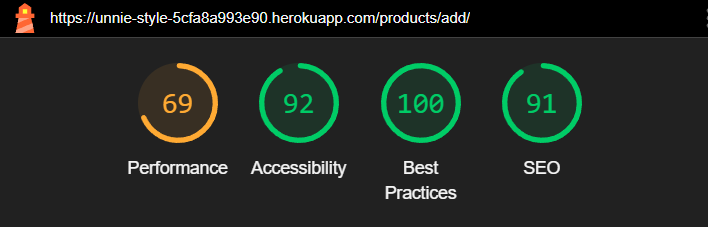
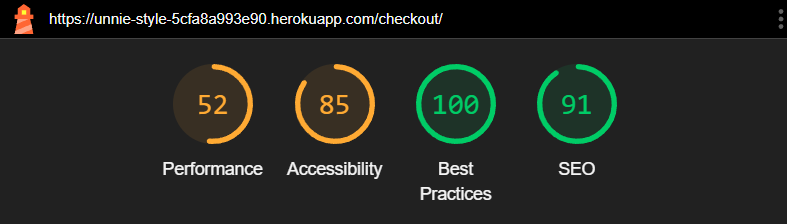
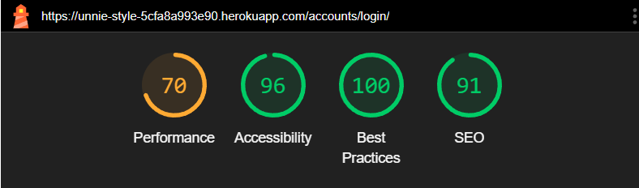

# TESTING

## Code validation

### W3C HTML Validator
* Index

* Products

* Add product

Since this was only information and does not affect the functionality of the site, I decided to leave it

* Add product image

Since this was only information and does not affect the functionality of the site, I decided to leave it

* Edit product

Since this was only information and does not affect the functionality of the site, I decided to leave it

* Product detail

* Bag

* Checkout

* Checkout success

* Profile

* Edit address

* Wishlist

* Sign up 

* Sign in

### W3C CSS Validator

There are 5 warnings. However since they do not affect the functionality of the project I decided to leave them as is.

### JSHINT Javascript Validator

### Python Validator

* I have checked all Python documents using [CI Python linter](https://pep8ci.herokuapp.com/) to ensure they are PEP8 compliant.
* For details please refer to [this document](documentation/testing/validation/python-testing.pdf)

## Lighthouse reports

Please note that ever since doing lighthouse testing, I have added meta data which has caused the SEO and Accessibility scores to go up

* Index page

* Products

* Add product

* add product image

* Edit product

* Product detail

* Bag

* Checkout

* Order history

* Profile

* Edit address

* Wishlist

* Sign up 

* Sign in

## Responsiveness testing
* Responsiveness testing was carried out on Chrome devtools. The screens covered include:

    - iPhone SE
    - iPhone XR
    - iPhone 12 Pro
    - Pixel 5
    - Samsung Galaxy S8+
    - Samsung Galaxy S20 Ultra
    - iPad Mini
    - iPad Air
    - Surface Pro 7
    - Surface Duo
    - Galaxy Fold
    - Samsung Galaxy A51/71
    - Nest Hub
    - Nest Hub Max

    [You can see screenshots here](documentation/testing/validation/responsiveness.pdf)

* The website was tested on 3 browsers: Firefox, Chrome and Opera to make sure they work correctly

## Manual testing

|feature	|action	|expected result|	tested	|passed	|comments|
|-----------|-------|---------------|-----------|-------|--------|
|**Footer**					|
|Facebook icon in the footer|	Click on the Facebook icon|The user is redirected to the Facebook page|	Yes|	Yes	|-|
|Tiktok icon in the footer|	Click on the Tiktok icon|The user is redirected to the Tiktok page|	Yes|	Yes	|-|
|Instagram icon in the footer|	Click on the Instagram icon|The user is redirected to the Instagram page|	Yes|	Yes	|-|
|**Navbar**	|
|Logo |Click on the logo| users will be directed to the home page | Yes | Yes | - |
|Navbar links |Click on each navbar link| users will be directed to the correct page | Yes | Yes | Navbar switches to mobile view for smaller screens |
|Searchbar |Search for a product| The product will filtered | Yes | Yes | Reset filter is also working as desired. Empty search also works |
|**Home Page**					|
|Category links |Click on the category images| The user is redirected to products page filtered by the category | Yes | Yes | - |
|Hero image |Change view from desktop to mobile| The hero image will be changed | Yes | Yes | - |
|**All products page and filter**					|
|Filters| Select a filter| The products will be filtered correctly | Yes | Yes | The clear filter link also works |
|Add to wishlist button |Click on the heart icon| product will be added to wishlist | Yes | Yes | - |
|Edit product |Click on the edit link| user will be directed to edit product | Yes | Yes | for admin only |
|Delete product |Click on the delete link| Product wil be deleted | Yes | Yes | for admin only |
|**Poducts details page**	
|Images enlarged when clicked| click an image| Image will be appended to main container enlarged | Yes | Yes | - |				|
|Add to wishlist| click 'Add to wishlist' button| Product will be added to wishlist | Yes | Yes | - |
|Toggle quantity| click plus/minus buttons| Quantity will be increased/decreased as desired | Yes | Yes | If quantity is below 1, the minus button will be disabled|
|Add to bag button |Click on the 'Add to bag' button | product will be added to bag | Yes | Yes | - |
|Edit link |Click on the edit link| user will be directed to edit product | Yes | Yes | for admin only |
|Delete link |Click on the delete link| Product wil be deleted | Yes | Yes | for admin only |
|**Bag Page**					|
|Add/remove items |Click plus/minus buttons in quantity selector| quantity will be updated | Yes | Yes | You cannot add a quantity less than 0 |
|Remove link |Click on the "Remove" link| Product will be removed | Yes | Yes | - |
|Update button |Click on the "Update" link| Prices will be updated if quantity is changed | Yes | Yes | - |
|**Checkout Page**					|
|Signed in users can save their address to their profile |Fill in address and ensure the checkbox is ticked|Address will be saved to profile|   Yes	|Yes| Form will be populated with default address if they have one|
|If not signed in, users will be directed to sign in |Click on the checkout button while not being signed in |The user is redirected to the sign in page|	Yes	|Yes|	-|
|Orders are added to user's profile page | Checkout successfully |Order will appear on profile page |	Yes	|Yes|	-|
|Successful orders are taken to checkout success page | Checkout successfully |you will be directed to checkout success page |	Yes	|Yes|	-|
|**Profile Page**					|
|Add address |Fill in address form |Address will be saved to profile|   Yes	|Yes|	Only one address can be the default|
|Edit address |Click on the edit link under an address and edit the address |The address will be changed|	Yes	|Yes|	-|
|Delete an address | Click on delete under an address |Address will be deleted |	Yes	|Yes|	-|
|Order history | Click on order number |you will be directed to order history page |	Yes	|Yes|	-|
|**Wishlist Page**					|
|Remove items |Click on the bin icon |Item will be removed|   Yes	|Yes|	-|
|Add to bag |Click on the add to bag button | Users will be taken to product detail page |	Yes	|Yes|	-|
|**Wishlist Page**					|
|Remove items |Click on the bin icon |Item will be removed|   Yes	|Yes|	-|
|Add to bag |Click on the add to bag button | Users will be taken to product detail page |	Yes	|Yes|	-|
|**User authentification**					|
|Sign up page |Fill in form on sign up page |User account will be created. User will receive email to authenticate email address|   Yes	|Yes|	-|
|Sign in page |Log in | Users will be taken to product index page |	Yes	|Yes|	-|
|Sign out |Log out | Users will be asked if they want to log out |	Yes	|Yes|	-|
|**Product management**					|
|Add product |Click on add product in navbar and fill in the form|Product will be created|   Yes	|Yes|	-|
|Add product image |Click on add images link and add an image | Image will be added for that product |	Yes	|Yes|	-|

## Bugs

### Updating images for product

* I attempted to create a form to allow admin to edit any extra images stored or each product through the website. However this proved difficult as the form would not be populated with the data and any attempt to save to the database would fail. Therefore I decided to discard this feature.

### Pre-populating the checkout form with a default address

* As users can have multiple addresses I tried to populate the checkout form with their selected default address. However this proved problematic since if they are ordering for the first time without an address already saved, there would be an error. This was due to me not filtering the data correctly so I had to use a filter rather than a get statement. Then I could use an if statement to check whther the address exists or not. Further tests showed that only the most recently addedd address would show up in the form as the default address (others would not show when set to default) which was solved with a break statement.
