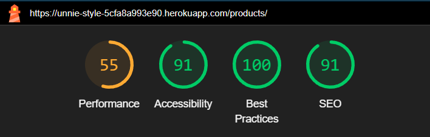

# TESTING

## Code validation

### W3C HTML Validator
* Index

* Products

* Add product

* Add product image

* Edit product

* Product detail

* Bag

* Checkout

* Checkout success

* Profile

* Edit address

* Wishlist

* Sign up 

* Sign in

### W3C CSS Validator

### JSHINT Javascript Validator

### Python Validator

* I have checked all Python documents using flake8 to ensure they are compliant.
* I left the code which I did not write 

## Lighthouse reports

* Index page

* Products

* Add product

* add product image

* Edit product

* Product detail

* Bag

* Checkout

* Order history

* Profile

* Edit address

* Wishlist

* Sign up 

* Sign in

## Responsiveness testing
* Responsiveness testing was carried out on Chrome devtools
* The website was tested on 3 browsers: Firefox, Chrome and Opera to make sure they work correctly

## Manual testing
### Navbar and footer
* The navigation links have been tested and worked. The navbar switches to mobile view for smaller screens 
* The social links in the footer have been tested and work

### Homepage
* The links to product category correctly lead to products page and filter by category
* The hero image changes for mobile view

### All products and filters
* The filters have been tested and work
* Reset filters also work as desired
* Links are working correctly

### Search
* Search bar works correctly
* Empty search works

### Products details page
* All buttons work as desired
* The edit and delete product link works when tested
* Images are enlarged when clicked on

### Bag
* Users can add and remove items
* Buttons work as expected

### Checkout
* Signed in users can save their address to their profile
* Successful orders are added to user profile page and users are taken to the checkout success page

### Profile page
* Users can add, edit and remove their addresses
* Links to order history works

### Wishlist page
* Users can remove items from their wishlist successfully

### User authentification
* Users can sign up, sign in and sign out sucessfully
* New users will recieve an email to authenticate their email address

### Product management
* Admin can successfully add a new product with images

## Bugs

### Updating images for product

* I attempted to create a form to allow admin to edit any extra images stored or each product through the website. However this proved difficult as the form would not be populated with the data and any attempt to save to the database would fail. Therefore I decided to discard this feature.

### Pre-populating the checkout form with a default address

* As users can have multiple addresses I tried to populate the checkout form with their selected default address. However this proved problematic since if they are ordering for the first time without an address already saved, there would be an error. This was due to me not filtering the data correctly so I had to use a filter rather than a get statement. Then I could use an if statement to check whther the address exists or not.
